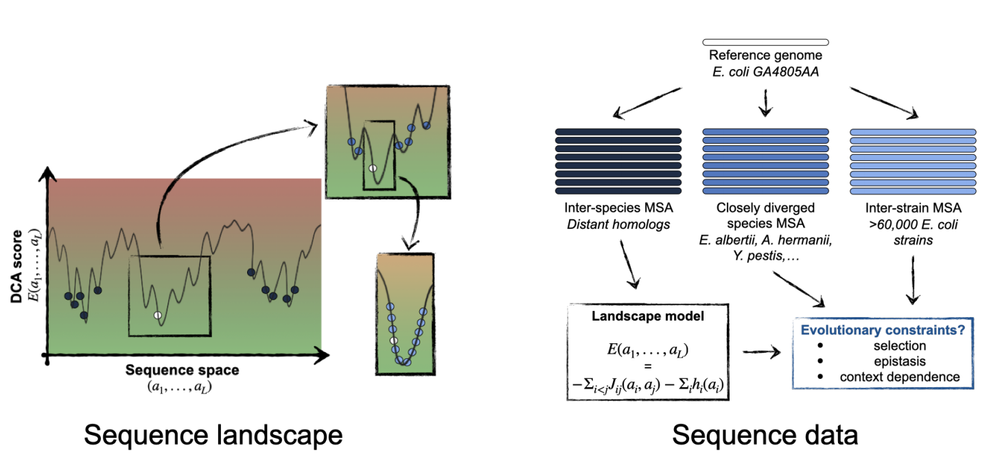

# DCA to decipher polymorphism in E. coli strains
We use computational models based on Direct Coupling Analysis - [DCA](https://en.wikipedia.org/wiki/Direct_coupling_analysis) - trained on [PFAM](http://pfam.xfam.org/) domains of distant distant homologues to accurately predict the polymorphisms segregating in a panel of 61,157 Escherichia coli genomes. 

We show that the genetic context (i.e. the rest of the protein sequence) strongly constrains the tolerable amino acids in 30% to 50% of amino-acid sites. 
The study suggests the gradual build-up of genetic context over long evolutionary timescales by the accumulation of small epistatic contributions.


Paper: [Deciphering polymorphism in 61,157 Escherichia coli genomes via epistatic sequence landscapes](link to the paper) (Vigué L.\*,  Croce G.\*, and al. xxxxxxx , 2021)



We provide here the code to reproduce the key results and figures of the paper.

## Installation:
To run the code, you first need to install :
- python3: (the code was tested on python v3.8)
- [julia:](https://julialang.org/)  to run the DCA pseudo-likelihood inference algorithm  (tested on julia v1.6)
- [hmmer package:](http://hmmer.org/) to generate the multiple sequence alignments (MSA) (tested on hmmer-3.3.2)

Then clone the repository to a directory of your choice, where you have writing permissions, and install the python libraries run (it is strongly recommended to use a virtual environment)
```
pip install requirements.txt
```

You also need to install plmDCA (pseudo-likelihood inference algorithm) for julia (see how to do it from https://github.com/pagnani/PlmDCA)

## Config your paths:

Before running the code, you need to set the paths to your julia and hmmalign executable in ```get_pfam_data.py```.
Open the file and replace ```path_hmmalign``` and  ```path_julia``` with the paths to the julia and hmmalign executable on your computer.

## Usage:
Our aim is to train a DCA model on distant homologues (PFAM data - long term evolution - highly variable sequences varibility) and use it to predict polymorphism in E. coli strains (short term evolution - most position are highly conserved).

### Download distant homologues (long-term evolution) and train the DCA model
-   select a reference protein in the E. coli strain (e.g. GA4805AA_00002)
-   select a PFAM domain contained in the protein (e.g. PF00288)
A list of all reference proteins and the correspoding PFAM domains is provided at ```ecoli_ref_proteins_pfam.txt```.

Then, run in you shell:
```
python get_pfam_data.py GA4805AA_00002 PF00288
```

The script will download the PFAM MSA of distant homologues (0) and align the reference protein to the MSA (1). After removing sequences from the PFAM MSA that are close to the references to avoid overfitting (2), we can finally train a plmDCA model (3).

The output you should see on your screen:
```
GA4805AA_00002 PF00288
0. Download pfam: PF00288
  % Total    % Received % Xferd  Average Speed   Time    Time     Time  Current
                                  Dload  Upload   Total   Spent    Left  Speed 
100 2242k  100 2242k    0     0   217k      0  0:00:10  0:00:10 --:--:--  545k

1. Align refs to pfam hmm

2. filter pfam msa
['ESC_GA4805AA', 'Fergusoni', 'Klebsiella_pneumoniae', 'Atlantibacter_hermannii', 'Pantoea_ananatis', 'K12', 'Albertii', 'E_coli_D', 'Yersiniia_pestis', 'Salmonella']
removed 6 seq

3. Train DCA model
DCA of ./pfam_msa/GA4805AA_00002-PF00288.fa
removing duplicate sequences... done: 27738 -> 23751
θ = 0.2 threshold = 11.0
M = 23751 N = 59 Meff = 9872.132486981445
preprocessing took 1.830936498 seconds
```


### Generate MSAs of E. coli strains (short-term evolution)
-   select a reference protein in the E. coli strain (e.g. GA4805AA_00002)
-   path to the E. coli strain proteome database

(merge with Lucile's code)

### Reproduce key results figures

```
python make_figures.py
```

